  <a href="#projects">
    <picture>
      <source media="(max-width: 600px)" srcset="./assets/hero-mobile.svg">
      <source media="(prefers-color-scheme: dark)" srcset="./assets/hero-dark.svg">
      <source media="(prefers-color-scheme: light)" srcset="./assets/hero-light.svg">
      
    </picture>
  </a>

<picture>
  <source media="(max-width: 600px)" srcset="./assets/tomato-runner-mobile.svg">
  
</picture>

  <a href="#projects">项目与作品</a> ·
  <a href="#skills">能力工具箱</a> ·
  <a href="#highlights">成长亮点</a> ·
  <a href="#campus">校园经历</a> ·
  <a href="#about">关于</a>

  开朗、可靠、行动派。把学习、创造与经历装订成一份持续生长的个人档案。

<picture>
  <source media="(max-width: 600px)" srcset="./assets/tomato-lab-mobile.svg">
  
</picture>

<picture>
  <source media="(max-width: 600px)" srcset="./assets/quick-facts-mobile.svg">
  
</picture>

<picture>
  <source media="(max-width: 600px)" srcset="./assets/tomato-heatmap-mobile.svg">
  
</picture>

> [!NOTE]
> **Now**：正在学习大模型训练与评测，持续构建 AI Agent、前端体验与 Kotlin 工程能力。

<h2 id="projects">项目与作品</h2>

### [`KeLing`](https://github.com/Hyhyhyyy/KeLing) `Kotlin` `Android`

以 Kotlin 为主的项目实践，在实现功能的同时持续打磨工程能力。

### [`KeLingAssistant`](https://github.com/Hyhyhyyy/KeLingAssistant) `Kotlin` `Knowledge Management`

课灵的多端知识管理学习助手，尝试让记录、整理与学习形成连贯体验。

### `AIGC` 创新项目

项目获全国大学生软件创新大赛省级三等奖；参与从创意验证、原型设计到实现优化的完整过程。

  
翻阅更多项目记录

   

- [All repositories](https://github.com/Hyhyhyyy?tab=repositories)
- [111](https://github.com/Hyhyhyyy/111) — Vue practice

<h2 id="skills">能力工具箱</h2>

- **原型与前端**：原型设计、前端体验优化，HTML5、CSS 与 JavaScript。
- **编程语言**：C/C++、Python、Kotlin，能够根据项目目标快速学习和组合工具。
- **AI 实践**：具备使用及编写简单 AI Agent 的基础能力，正在学习大模型训练与评测。
- **协作执行**：性格开朗，执行力强，踏实肯干；重视明确目标、及时反馈与可靠交付。

  
正在整理的知识索引

   

- Kotlin、Android 与多端工程实践
- Web 前端、交互原型与体验优化
- AI Agent、大模型训练与评测
- Git、开源协作与项目复盘

<h2 id="highlights">成长亮点</h2>

- [x] **2025—2026 大学生创新创业训练计划**：项目待结题。
- [x] **全国大学生软件创新大赛**：AIGC 方向项目获省级三等奖。
- [x] **语言能力**：IELTS 7.5，CET-4 650+。
- [x] **工作与实践**：具有学生工作、志愿服务和社会实践经验，能够在团队中持续推进任务落地。

<h2 id="campus">校园经历</h2>

大连理工大学软件学院（国际信息与软件学院）大一升大二学生。关注软件产品、AIGC 与智能应用，也在学生工作、志愿服务和社会实践中积累组织、沟通与协作经验。

> 敬，真相与自由！

<h2 id="about">关于</h2>

  <a href="https://github.com/Hyhyhyyy">GitHub</a> ·
  <a href="https://github.com/Hyhyhyyy?tab=repositories">Repositories</a>

  Growth Archive · Public GitHub data only · No visitor tracking

