  <a href="#flagship-projects">
    <picture>
      <source media="(max-width: 600px)" srcset="./assets/hero-mobile.svg">
      <source media="(prefers-color-scheme: dark)" srcset="./assets/hero-dark.svg">
      <source media="(prefers-color-scheme: light)" srcset="./assets/hero-light.svg">
      
    </picture>
  </a>

  <a href="#focus">技术方向</a> ·
  <a href="#flagship-projects">代表项目</a> ·
  <a href="#selected-work">更多作品</a> ·
  <a href="#about">关于</a>

  <strong>软件工程学生，专注 LLM/VLM 训练可靠性、可复现评测与 AI Agent 工程。</strong> 
  Software engineering student building reliable training, evaluation, and agent tooling for LLM/VLM systems.

<h2 id="focus">🎯 技术方向</h2>

- **训练可靠性**：训练前检查、运行时观测、结构化事件、检查点验收与受控恢复。
- **可复现实验**：配置、评测、实验台账、数据与发布物 SHA-256 归档。
- **AI Agent 工程**：Prompt/Skill 资产优化、语义缓存、用量统计与成本控制。
- **产品工程**：Python、Kotlin、React、FastAPI、Docker 与 GitHub Actions。

当前重点：持续维护 [`train_guard`](https://github.com/Hyhyhyyy/train_guard)，并整理
[`Qwen3-VL-Med`](https://github.com/Hyhyhyyy/Qwen3-VL-Med) 的脱敏、可复现实验资产。

<h2>📊 GitHub 公开数据</h2>

  
  

<h2 id="flagship-projects">🚀 代表项目</h2>

### [`train_guard`](https://github.com/Hyhyhyyy/train_guard) · Python / LLM / MLOps

本地优先的 LLM/VLM 训练可靠性工具包。零必需依赖核心，覆盖训练前检查、训练中观测、
结构化事件、检查点验收与显式受控恢复，并提供 CLI、Python API、Web 看板和 SSH TUI。

**证据入口：** [三分钟上手](https://github.com/Hyhyhyyy/train_guard#three-minute-workflow) ·
[架构](https://github.com/Hyhyhyyy/train_guard/blob/main/ARCHITECTURE.md) ·
[可靠性边界](https://github.com/Hyhyhyyy/train_guard/blob/main/docs/RELIABILITY.md) ·
[测试](https://github.com/Hyhyhyyy/train_guard/tree/main/tests)

### [`Qwen3-VL-Med`](https://github.com/Hyhyhyyy/Qwen3-VL-Med) · Python / VLM / Medical AI

Qwen3-VL 医疗多图报告微调与评测的公开工程实践。公开 R01–R18 受控实验台账、
全量与 LoRA 配置、13 项评测协议、冻结消融和隐私/权重发布门禁；仓库仅含脱敏代码、
合成示例与聚合结果，不包含临床数据或模型权重。

**证据入口：** [工程成果](https://github.com/Hyhyhyyy/Qwen3-VL-Med#工程成果概览) ·
[实验台账](https://github.com/Hyhyhyyy/Qwen3-VL-Med/blob/main/docs/RUN_LEDGER.md) ·
[聚合结果](https://github.com/Hyhyhyyy/Qwen3-VL-Med/blob/main/docs/AGGREGATE_RESULTS.md) ·
[复现说明](https://github.com/Hyhyhyyy/Qwen3-VL-Med/blob/main/docs/REPRODUCIBILITY.md)

### [`Token_Saver`](https://github.com/Hyhyhyyy/Token_Saver) · Python / FastAPI / SQLite

面向 AI 工作台 Skill 资产的本地优化工具：统一格式校验、语义清洗、Token 预算压缩、
调用效果追踪与可视化看板，支持 Docker 或本地部署。

**证据入口：** [快速开始](https://github.com/Hyhyhyyy/Token_Saver#快速开始) ·
[效果度量](https://github.com/Hyhyhyyy/Token_Saver#效果度量) ·
[测试](https://github.com/Hyhyhyyy/Token_Saver/tree/main/tests)

<h2 id="selected-work">🧩 更多作品</h2>

  
<strong>产品、研究与校园项目</strong>

   

- [`KeLing3.0`](https://github.com/Hyhyhyyy/KeLing3.0) — Kotlin + React 多端知识管理学习助手。
- [`fault-repair-benchmark`](https://github.com/Hyhyhyyy/fault-repair-benchmark) — 云边环境 AI 基础设施故障修复 Agent 的可复现 benchmark。
- [`edgemind`](https://github.com/Hyhyhyyy/edgemind) — 云边协同 LLM 推理、RCA 与自动修复实验平台。
- [`neoscholar-ragebait-archive`](https://github.com/Hyhyhyyy/neoscholar-ragebait-archive) — 基于 3.4 万条 YouTube 评论的 R 语言文本研究归档。
- [`DUT-ultimate-website`](https://github.com/Hyhyhyyy/DUT-ultimate-website) — 大连理工大学开发区校区黑蚁极限飞盘队官网。
- [`MLP-2048`](https://github.com/Hyhyhyyy/MLP-2048) — C++ / EasyX 制作的《小马宝莉》主题 2048 游戏。
- [`MyBlog`](https://hyhyhyyy.github.io/MyBlog/) — 记录学习、项目与公开表达的个人博客。

  
<strong>技术栈</strong>

   

`Python` · `Kotlin` · `Java` · `JavaScript/TypeScript` · `R` · `C/C++` ·
`FastAPI` · `React` · `Spring Boot` · `SQLite` · `Docker` · `GitHub Actions`

<h2 id="about">🌱 关于</h2>

我重视可验证的结果、清楚的安全边界和能够被他人复现的工程过程。欢迎围绕 LLM/VLM
训练可靠性、评测工程与 AI Agent 工具交流，也欢迎在相关仓库提交 Issue 或 PR。

  <a href="https://ghfind.com/u/hyhyhyyy?ref=badge">
    <picture>
      <source media="(prefers-color-scheme: dark)" srcset="https://ghfind.com/api/card/mini/hyhyhyyy?theme=dark&lang=zh" />
      
    </picture>
  </a>

<picture>
  <source media="(max-width: 600px)" srcset="./assets/tomato-heatmap-mobile.svg">
  
</picture>
