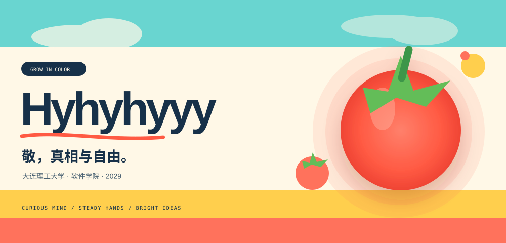
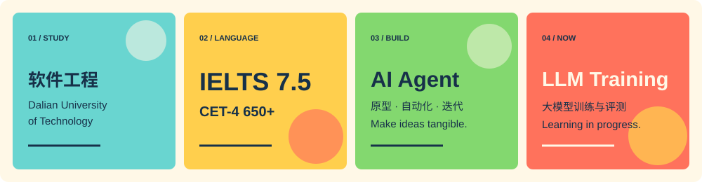

  <a href="#projects">
    <picture>
      <source media="(max-width: 600px)" srcset="./assets/hero-mobile.svg">
      <source media="(prefers-color-scheme: dark)" srcset="./assets/hero-dark.svg">
      <source media="(prefers-color-scheme: light)" srcset="./assets/hero-light.svg">
      
    </picture>
  </a>

  <a href="#skills">能力工具箱</a> ·
  <a href="#projects">项目与作品</a> ·
  <a href="#about">关于</a>

  开朗、可靠、行动派。把学习、创造与经历装订成一份持续生长的个人档案。

<picture>
  <source media="(max-width: 600px)" srcset="./assets/quick-facts-mobile.svg">
  
</picture>

<picture>
  <source media="(max-width: 600px)" srcset="./assets/tomato-runner-mobile.svg">
  
</picture>

<h2 id="skills">🔧 能力工具箱</h2>

⭐ - **编程语言**：Python、Kotlin、Java、JavaScript，并熟悉 C/C++；能根据项目目标快速学习并组合工具。

⭐ - **AI 与大模型**：具备大模型 / 视觉语言模型（LLM/VLM）训练、评测与可靠性保障的实践经验——落地过 Qwen3-VL 视觉语言模型的全量与 LoRA 微调、训练—评测流水线与可复现实验管理（checkpoint / 数据集 SHA-256 归档）；能开发与优化 AI Agent（含 Token 节省与成本控制）。

⭐ - **前端与可视化**：前端体验优化，熟练使用 HTML5、CSS3、JavaScript 与 React，以及 SVG 动效与 README 美化。

⭐ - **工程与基础设施**：Spring Boot、Vue、FastAPI、SQLite、Docker 与 GitHub Actions；具备区块链（DID / 可验证凭证）应用经验。

⭐ - **协作执行**：性格开朗，执行力强，踏实肯干；重视明确目标、及时反馈与可靠交付。

<h2 id="projects">📚 项目与作品</h2>

### 📌 [`Qwen3-VL-Med`](https://github.com/Hyhyhyyy/Qwen3-VL-Med) `Python` `LLM` `VLM` 🩺

- Qwen3-VL 医疗领域微调的公开代码仓库：提供全量微调配置模板、四组 LoRA 冻结消融实验与评测工具，聚焦 WSI 病理报告生成的可复现训练研究（已做隐私脱敏）。

### 📌 [`train_guard`](https://github.com/Hyhyhyyy/train_guard) `Python` `LLM` `MLOps` 🛡️

- 本地优先的大模型 / 视觉语言模型（LLM/VLM）训练检查、可靠性事件与受控恢复工具包。

### 📌 [`KeLing3.0`](https://github.com/Hyhyhyyy/KeLing3.0) `Kotlin` `Android` 🌱

- 🌱 课灵 —— 多端知识管理学习助手，让记录、整理与学习形成连贯体验。

### 📌 [`KeLing2.0`](https://github.com/Hyhyhyyy/KeLing2.0) `Kotlin` `React` `Monorepo` 📚

- 课灵 2.0 单体仓库：Android 与多端知识管理能力的进阶实践（最受星标项目）。

### 📌 [`ChainPass`](https://github.com/Hyhyhyyy/ChainPass) `Java` `Blockchain` 🔗

- 基于区块链的跨境数字身份与合规支付解决方案，采用 W3C DID 与可验证凭证（VC）技术。

### 📌 [`DUT-ultimate-website`](https://github.com/Hyhyhyyy/DUT-ultimate-website) `JavaScript` `Website` 🥏

- 大连理工大学开发区校区黑蚁极限飞盘队官网，呈现球队信息与活动。

### 📌 [`md-converter`](https://github.com/Hyhyhyyy/md-converter) `JavaScript` `Markdown` 📝

- 轻量的前端 Markdown ↔ PDF / DOCX 转换工具。

### 📌 [`Token_Saver`](https://github.com/Hyhyhyyy/Token_Saver) `Python` `FastAPI` 💰

- SkillForge · Token Saver：面向 AI 智能体的 Token 节省与优化框架。

### 📌 [`README-beautifier`](https://github.com/Hyhyhyyy/README-beautifier) `Python` 🎨

- GitHub README 美化工具，生成动画横幅、图标与着陆页。

  
翻阅更多项目记录

   

- [All repositories](https://github.com/Hyhyhyyy?tab=repositories)

<h2 id="about">关于</h2>

<picture>
  <source media="(max-width: 600px)" srcset="./assets/tomato-heatmap-mobile.svg">
  
</picture>

  <a href="https://github.com/Hyhyhyyy">GitHub</a> ·
  <a href="https://github.com/Hyhyhyyy?tab=repositories">Repositories</a>

  Growth Archive · Public GitHub data only · No visitor tracking

