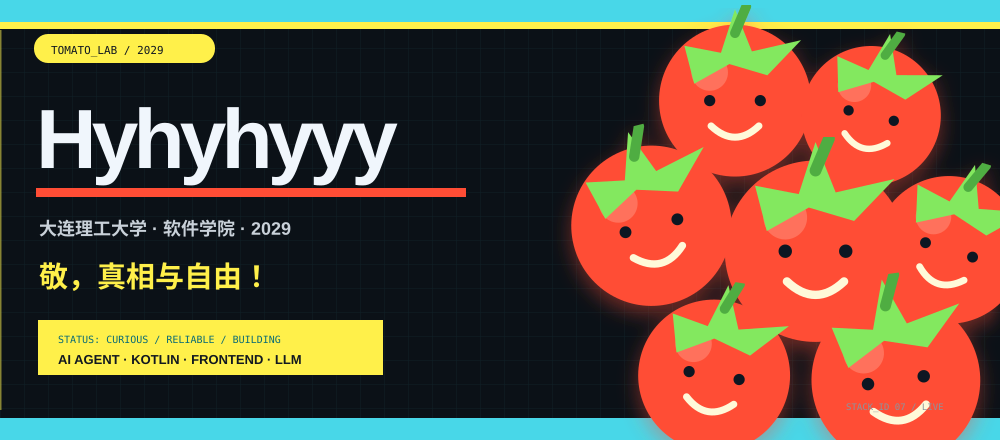

  <a href="#projects">
      <picture>
    <source media="(max-width: 600px)" srcset="./assets/hero-mobile.svg">
    
  </picture>
  </a>

  <a href="#skills">能力工具箱</a> ·
  <a href="#projects">项目与作品</a> ·
  <a href="#about">关于</a>

  开朗、可靠、行动派。把学习、创造与经历装订成一份持续生长的个人档案。

<picture>
  <source media="(max-width: 600px)" srcset="./assets/quick-facts-mobile.svg">
  
</picture>

<picture>
  <source media="(max-width: 600px)" srcset="./assets/tomato-runner-mobile.svg">
  
</picture>

<h2 id="skills">🔧 能力工具箱</h2>

⭐ - **编程语言**：Python、Kotlin、Java、JavaScript、R，并熟悉 C/C++；能根据项目目标快速学习并组合工具。

⭐ - **AI 与大模型**：具备大模型 / 视觉语言模型（LLM/VLM）训练、评测与可靠性保障的实践经验——落地过 Qwen3-VL 视觉语言模型的全量与 LoRA 微调、训练—评测流水线与可复现实验管理（checkpoint / 数据集 SHA-256 归档）；能开发与优化 AI Agent（含 Token 节省与成本控制）。

⭐ - **前端与可视化**：前端体验优化，熟练使用 HTML5、CSS3、JavaScript 与 React，以及 SVG 动效与 README 美化。

⭐ - **数据分析与科研**：能独立完成「采集—清洗—分析—可视化—论文写作」的研究闭环；熟练使用 R / Python 进行统计分析、主题聚类与情绪分析等文本挖掘，曾用于 YouTube 引战评论话语的实证研究。

⭐ - **工程与基础设施**：Spring Boot、Vue、FastAPI、SQLite、Docker 与 GitHub Actions；具备区块链（DID / 可验证凭证）应用经验。

⭐ - **协作执行**：性格开朗，执行力强，踏实肯干；重视明确目标、及时反馈与可靠交付。

<h2 id="projects">📚 项目与作品</h2>

## 🤖 AI 与大模型

### 📌 [`Qwen3-VL-Med`](https://github.com/Hyhyhyyy/Qwen3-VL-Med) `Python` `LLM` `VLM` 🩺

- Qwen3-VL 医疗领域微调的公开代码仓库：提供全量微调配置模板、四组 LoRA 冻结消融实验与评测工具，聚焦 WSI 病理报告生成的可复现训练研究（已做隐私脱敏）。

### 📌 [`train_guard`](https://github.com/Hyhyhyyy/train_guard) `Python` `LLM` `MLOps` 🛡️

- 本地优先的大模型 / 视觉语言模型（LLM/VLM）训练检查、可靠性事件与受控恢复工具包。

### 📌 [`Token_Saver`](https://github.com/Hyhyhyyy/Token_Saver) `Python` `FastAPI` 💰

- SkillForge · Token Saver：面向 AI 智能体的 Token 节省与优化框架。

### 📌 [`edgemind`](https://github.com/Hyhyhyyy/edgemind) `Python` `LLM` `Edge` ☁️

- 云边协同的大模型推理与运维自愈平台：基于 Python 标准库零依赖实现，含 KubeEdge 云边通信、vLLM 接入与分层调度、故障根因分析（RCA）与自动修复 Agent，并附 Docker / Kubernetes 部署清单，可在普通笔记本直接运行。

## 📱 移动应用

### 📌 [`KeLing3.0`](https://github.com/Hyhyhyyy/KeLing3.0) `Kotlin` `Android` 🌱

- 🌱 课灵 —— 多端知识管理学习助手，让记录、整理与学习形成连贯体验。

### 📌 [`KeLing2.0`](https://github.com/Hyhyhyyy/KeLing2.0) `Kotlin` `Android` 📚

- 课灵 2.0 知识管理学习助手：Kotlin + React 单体仓库，在初代基础上重构工程结构与多端架构，内置知识卡片、标签体系与跨端同步，是课灵系列中星标最多的版本。

### 📌 [`KeLing1.0`](https://github.com/Hyhyhyyy/KeLing1.0) `Kotlin` `Android` 💡

- 课灵初代 AI 学习助手（Kotlin）：集成课表管理、OCR 板书识别、知识点解答与资料云端共享，是课灵知识管理系列的起点。

## 🌐 Web 与工具

### 📌 [`DUT-ultimate-website`](https://github.com/Hyhyhyyy/DUT-ultimate-website) `JavaScript` `Website` 🥏

- 大连理工大学开发区校区黑蚁极限飞盘队官网，呈现球队信息与活动。

### 📌 [`md-converter`](https://github.com/Hyhyhyyy/md-converter) `JavaScript` `Markdown` 📝

- 轻量的前端 Markdown ↔ PDF / DOCX 转换工具。

### 📌 [`README-beautifier2.0`](https://github.com/Hyhyhyyy/README-beautifier2.0) `Python` `Skill` 🎨

- GitHub README 美化技能：基于纯 SMIL 动画横幅（每仓手绘、零预设复用）一键美化仓库首页，支持批量生成动画 Hero、主题图标与着陆页。

### 📌 [`README-beautifier1.0`](https://github.com/Hyhyhyyy/README-beautifier1.0) `Python` `Skill` 🎨

- README 美化工具 1.0（历史版本）：早期实现的动画横幅、主题图标与着陆页生成，方法平台无关，供任何能绘图并推送 GitHub 的 Agent / 工具复用。

### 📌 [`MyBlog`](https://github.com/Hyhyhyyy/MyBlog) `TypeScript` `Blog` ✍️

- 全栈个人成长博客：Next.js 16 RSC + React 19 + Tailwind v4 + Drizzle / D1（Cloudflare Workers），记录学习与公开表达，
- [👉 在线访问](https://hyhyhyyy.github.io/MyBlog/)。

### 📌 [`TOMATOMATOO`](https://github.com/Hyhyhyyy/TOMATOMATOO) `JavaScript` `MiniProgram` 🍅

- 双人习惯养成微信小程序：两人绑定、前一天约定次日计划、当天各自完成互见进度，把坚持可视化成一片共享番茄园；基于微信小程序原生 + 云开发 CloudBase，零服务器即可上线。

## ⛓️ 区块链

### 📌 [`ChainPass`](https://github.com/Hyhyhyyy/ChainPass) `Java` `Blockchain` 🔗

- 基于区块链的跨境数字身份与合规支付解决方案，采用 W3C DID 与可验证凭证（VC）技术。

## 🔬 研究探索

### 📌 [`neoscholar-ragebait-archive`](https://github.com/Hyhyhyyy/neoscholar-ragebait-archive) `R` `Research` 🔍

- YouTube 引战评论话语研究归档：基于 R 与 YouTube Data API，从 3.4 万条父级评论中用主题聚类与情绪分析比较出镜 / 旁白视频的评论差异；含研究论文、复盘与脱敏数据流程，遵循研究伦理。

## 🎮 游戏

### 📌 [`MLP-2048`](https://github.com/Hyhyhyyy/MLP-2048) `C++` `Game` 🦄

- 基于 EasyX 图形库的《小马宝莉》主题 2048 合成游戏：C++ 编写，含六大角色关卡、剧情 CG、技能与背景音乐。

  
翻阅更多项目记录

   

- [All repositories](https://github.com/Hyhyhyyy?tab=repositories)

<h2 id="about">关于</h2>
<a href="https://ghfind.com/u/hyhyhyyy?ref=badge">
  <picture>
    <source media="(prefers-color-scheme: dark)" srcset="https://ghfind.com/api/card/mini/hyhyhyyy?theme=dark&lang=zh" />
    
  </picture>
</a>
<picture>
  <source media="(max-width: 600px)" srcset="./assets/tomato-heatmap-mobile.svg">
  
</picture>
